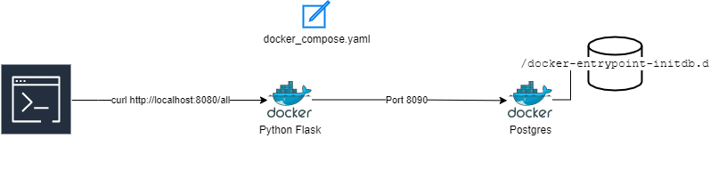

# birthday-reminder

A simple hello world app which demonstrates various DevOps/SRE concepts

This application accepts the user's date of birth as a PUT call and can respond to the user by wishing them on their
birthday or it will mention the number of days till the current year's birth day.

### Example response

- If username’s birthday is in N days:

```shell
{ “message”: “Hello, <username>! Your birthday is in N day(s)” }
```

- If username’s birthday is today:

```shell
{ “message”: “Hello, <username>! Happy birthday!” }
```

### System Details

JSON API is written using [Flask](https://flask.palletsprojects.com/en/2.0.x/) and
[Python](https://www.python.org/downloads/)

User data is persisted in [Postgres](https://www.postgresql.org/download/). The connnection between these two is handled
using the [SQLAlchemy](https://pypi.org/project/SQLAlchemy/) library.



### Local test workflow

Build the images and spin up the containers:

```shell
docker-compose up -d --build
docker-compose exec server python manage.py recreate_db
docker-compose exec server python manage.py seed_db
```

Test it out at:

- A ping response from the container at [http://localhost:8080/](http://localhost:8080/)
- All entries visible at [http://localhost:8080//hello/all](http://localhost:8080//hello/all)
- To see the details of a new user:

```shell
  curl http://localhost:5000/hello/ironman
```

- To add a new username you can use the PUT verb

```shell
  curl -X PUT -d '{"dateOfBirth":"1993-01-01"}' -H "Content-Type: application/json" localhost:8080/hello/captainmarvel
```

When you want to shut down the application:

`docker-compose down`

The postgresql database image uses a very simple SQL database [create.sql](services/db/create.sql) which is needed to initialize the database with the
proper table to contain the names and birthday dates schema.

